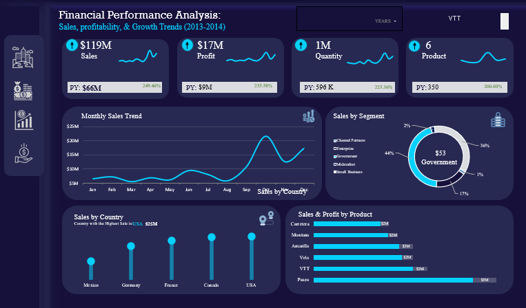

<!--Section 1: Introduce your self-->
## ABOUT ME

Hi, I'm Jennifer Ekpite 👋 I am a Data Analyst with hands-on experience transforming raw data into meaningful insights that support smarter business decisions. I specialize in Excel,Power BI, and SQL using data cleaning, analysis, visualization, and interactive dashboards to uncover trends, solve business problems, and communicate findings clearly.

My background in customer support, administration, and education gives me a unique ability to understand business needs, analyze data from different perspectives, and present insights in a way that stakeholders can easily act on.

<!--Mention your top/relevant skills here - core and soft skills-->
## WHAT I DO

* As a Data Analyst, I transform raw data into meaningful insights that support smarter business decisions. *

**- ✅ Data Cleaning and Transformatio**

**- ✅ Data Interpretation and Business Insights**

**- ✅ KPI Development and Performance Tracking**

**- ✅ Reporting and Data Storytelling**

**- ✅ Problem Solving**

**- ✅ Critical Thinking**

**- ✅ Attention to Detail**

**- ✅Communication and Presentation**

**- ✅Stakeholder Management**

**- ✅Time Management**

<!--Section 2: List 3-4 key projects-->
## MY PROJECTS

*A glimpse of some of the projects I've worked on.*

**Financial Performance Analysis.**

Every successful business — whether it’s Amazon, Dangote Group, or a fast-growing startup — survives on one key ability:
👉 understanding its numbers and acting on them at the right time. This analysis uncovers sales performance, profitability trends, product impact, and regional contribution — helping decision-makers move from guesswork to data-driven strategy.

<a href="Financial Analysis.pdf">Download the Report here (pdf file)</a>
<!---[Read More]()--->

**Adidas Sales Performance Analysis (2020–2022).**

This project analyzes Adidas’ sales performance from 2020 to 2022 using Microsoft Excel to uncover trends in revenue, profitability, product performance, sales channels, retailers, and regional contribution.

<a href="Adidas_Sales_Dashboard_Report.pdf ">Download the Report here (pdf file)</a>

**Bay Sales Performance Analysis (2017–2020).**

This analysis transforms Bay’s historical sales data from 2017 to 2020 into a clear, visual, and actionable dashboard, enabling leadership to understand performance trends, identify key revenue drivers, and make informed strategic decisions.
 

<a href="Bay Sales Analysis.pdf">Download the Report here (pdf file)</a>

**Walmart Sales Performance Analysis.**

This Power BI dashboard was built to transform raw transactional data into clear business insights, enabling management to understand performance, identify opportunities, and take data-driven actions confidently.

<a href="Walmart Sales.pdf">Download the Report here (pdf file)</a>

**Bike Purchase Analysis Dashboard.**

Think about how people choose a bike today.
Some buy bikes for convenience, others for fitness, lifestyle, or cost-saving reasons. For businesses selling bikes, rentals, or mobility solutions, understanding who buys a bike and why is more important than just tracking sales numbers.

<a href="Bike Purchase.pdf">Download the Report here (pdf file)</a>

**Biscuit Sales Performance Dashboard.**

In today’s competitive consumer goods market, companies no longer succeed by simply selling more products — they succeed by understanding who buys, what they buy, where they buy from, and why they choose certain products over others. This Biscuit Sales Performance Dashboard was designed to provide a 360-degree view of sales, profitability, customer behavior, and geographic performance, enabling data-driven decision-making and strategic planning.

<a href="Biscuit Sales Performance Dashboard.pdf">Download the Report here (pdf file)</a>

**GlobalShala Super Hero-U Campaign Analysis.**

Superhero U is a visionary marketing campaign designed to inspire innovation and inventiveness among youth. Its mission is to empower imaginative and passionate young minds to harness their skills and creativity effectively. Drawing inspiration from the UN's vision “to promote prosperity while protecting the planet”, Superhero U took the form of a competitive event
aimed at fostering equality and encouraging educational opportunities. By blending creativity with a sense of purpose, the campaign sought to nurture future leaders who could drive sustainable progress and impactful change.

<a href="Sharla Marketing.pdf">Download the Report here (pdf file)</a>

## CONTACT DETAILS

*Let’s connect and see how we can make a difference together!*
<table>
  <tbody>
    <tr>
      <td>📧</td>
      <td><a href="mailto:ekpitejennifer@gmail.com">ekpitejennifer@gmail.com</a></td>
    </tr>
    <tr>
      <td>📞</td>
      <td>(234) 706-539-7274</td>
    </tr>
    <tr>
      <td>📍</td>
      <td>Akure, Nigeria</td>
    </tr>
    <tr>
      <td>⬇️</td>
      <td><a href="Ekpite Jennifer Data Analysis.pdf">Download my CV</a></td>
    </tr>
    <tr>
      <td>🌐</td>
      <td><a href="https://www.linkedin.com/in/ekpite-jennifer">The things I do daily on LinkedIn</a></td>
    </tr>
    <tr>
      <td>📺</td>
      <td><a href="https://www.facebook.com/share/17oVXiApUW/">Connect with me on Facebook</a></td>
    </tr>
  </tbody>
</table>

   

